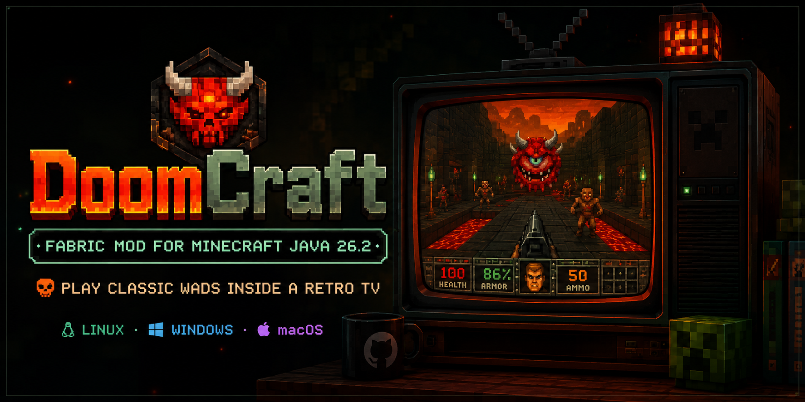

<p align="center">
  
</p>

<h1 align="center">DoomCraft 1.0.0</h1>

<p align="center">
  Uma televisão CRT funcional dentro do Minecraft, executando WADs fornecidos pelo jogador por meio de um processo LZDoom isolado.
</p>

<p align="center">
  <a href="https://github.com/ChromusMaster/DoomCraft/releases">
    
  </a>
  <a href="https://github.com/ChromusMaster/DoomCraft/actions/workflows/build-multiplatform.yml">
    
  </a>
  
  
  
  <a href="LICENSE">
    
  </a>
</p>

<p align="center">
  <strong>Linux x86-64 · Windows x86-64 · macOS Intel · macOS Apple Silicon</strong>
</p>

---

## Visão geral

O **DoomCraft** adiciona uma televisão CRT low-poly capaz de executar jogos e modificações no formato WAD dentro do Minecraft Java Edition.

A engine roda em um processo nativo separado da JVM. O mod captura o framebuffer do LZDoom, transmite os comandos do jogador e renderiza a imagem diretamente na tela da televisão colocada no mundo.

> [!IMPORTANT]
> O DoomCraft **não distribui WADs**. O jogador deve utilizar arquivos obtidos legalmente e colocá-los na pasta indicada pelo mod.

## Recursos principais

- televisão CRT craftável, leve e integrada ao mundo;
- execução de IWADs e PWADs fornecidos pelo usuário;
- imagem dinâmica em **640 × 400**, limitada a **30 FPS**;
- áudio do LZDoom reproduzido normalmente;
- suporte a Linux, Windows e macOS em um único JAR;
- variantes visuais baseadas na madeira usada na receita;
- sessões isoladas por televisão;
- pausa, hibernação e descarregamento automático por distância;
- save state automático para continuidade da sessão;
- savegame manual por tecla, sem necessidade de digitar nomes;
- limite de memória e watchdog para o processo nativo;
- estado visual `broken`, com tela rachada;
- compilação multiplataforma automatizada pelo GitHub Actions.

## Compatibilidade

| Componente | Versão |
|---|---:|
| Minecraft Java Edition | 26.2 |
| Java | 25 |
| Fabric Loader | 0.19.3 ou superior compatível |
| Fabric API | 0.155.2+26.2 ou superior compatível |
| Fabric Loom | 1.17.16 |
| Gradle Wrapper | 9.6.1 |
| LZDoom | 4.14.4 |
| ZMusic | 1.1.14 |

### Plataformas incluídas no JAR multiplataforma

| Plataforma | Arquitetura | Estado |
|---|---|---|
| Linux | x86-64 | suportada |
| Windows | x86-64 | suportada |
| macOS | Intel x86-64 | suportada |
| macOS | Apple Silicon ARM64 | suportada |

Linux ARM64 e Windows ARM64 não fazem parte da matriz da versão 1.0.0.

## Instalação

### 1. Instale os requisitos

- Minecraft Java Edition 26.2;
- Java 25;
- Fabric Loader 0.19.3;
- Fabric API 0.155.2+26.2.

### 2. Baixe o mod

Baixe o arquivo:

```text
doomcraft-1.0.0-multiplatform.jar
```

na página de [Releases](https://github.com/ChromusMaster/DoomCraft/releases).

### 3. Instale o JAR

Coloque o arquivo na pasta:

```text
.minecraft/mods/
```

Não coloque o ZIP do artefato do GitHub Actions diretamente na pasta `mods`. Extraia o ZIP e use somente o arquivo `.jar`.

### 4. Adicione seus WADs

Inicie o jogo uma vez. O DoomCraft criará automaticamente:

```text
config/doomcraft/wads/
```

Feche o jogo, coloque seus arquivos `.wad` nessa pasta e abra novamente.

## Carregamento de WADs

A seleção segue esta ordem:

1. procura um IWAD conhecido, como `doom2.wad`, `doom.wad`, `freedoom2.wad` ou equivalente;
2. trata os demais arquivos `.wad`, em ordem alfabética, como PWADs adicionais;
3. quando nenhum IWAD reconhecido é encontrado, utiliza o primeiro WAD disponível como IWAD.

Exemplo:

```text
config/doomcraft/wads/
├── freedoom2.wad
├── mapa_adicional.wad
└── mod_de_armas.wad
```

Trinta segundos após a entrada no mundo, o mod informa que nenhum WAD é distribuído e apresenta o caminho absoluto da pasta.

## Receita da televisão

```text
F F F
V R V
T T T
```

| Símbolo | Ingrediente |
|---|---|
| `F` | lingote de ferro |
| `V` | vidraça comum, sem cor |
| `R` | pó de redstone |
| `T` | qualquer tábua de madeira |

Ingredientes totais:

- 3 lingotes de ferro;
- 2 vidraças;
- 1 pó de redstone;
- 3 tábuas de madeira.

Quando as três tábuas são do mesmo tipo vanilla reconhecido, a televisão recebe a textura correspondente. Madeiras de mods, tipos misturados ou madeiras não reconhecidas utilizam a aparência padrão de carvalho.

## Estados da televisão

| Distância do jogador mais próximo | Estado | Processo LZDoom | Persistência |
|---:|---|---|---|
| 0–4 blocos | `active` | executando em tempo real | sessão ativa |
| acima de 4 até 8 blocos | `paused` | pausado | save state gerado |
| acima de 8 blocos | `off` | encerrado e removido da RAM | save state preservado |
| estado quebrado | `broken` | encerrado | tela rachada |

Somente a televisão mais próxima pode manter uma sessão nativa ativa no cliente. Essa limitação evita que várias TVs iniciem várias engines simultaneamente.

### Estado quebrado

Agache e use a televisão para alternar o estado `broken`.

Quando quebrada:

- a tela rachada é exibida;
- os controles são liberados;
- a sessão ativa é salva;
- o processo nativo é encerrado.

## Controles

Pressione `Insert` próximo de uma televisão ativa para capturar ou liberar os controles.

| Ação | Tecla padrão |
|---|---|
| capturar ou liberar controles | `Insert` |
| avançar | seta para cima |
| recuar | seta para baixo |
| virar à esquerda | seta para esquerda |
| virar à direita | seta para direita |
| atacar | `Ctrl direito` |
| usar, abrir ou confirmar | `Enter` |
| correr | `Shift direito` |
| arma anterior | `Page Up` |
| próxima arma | `Page Down` |
| abrir ou voltar em menus | `Backspace` |
| criar savegame manual | `Home` |
| carregar o savegame manual mais recente | `End` |

Todos os atalhos podem ser alterados nas configurações de controles do Minecraft.

## Saves e persistência

Cada televisão possui um UUID próprio e armazena sua sessão em:

```text
config/doomcraft/saves/<UUID-DA-TV>/
```

### Save state automático

O save state automático é utilizado quando:

- o jogador se afasta da televisão;
- a sessão entra em hibernação;
- o processo é descarregado da memória;
- o mundo é fechado.

Ao retornar para a mesma televisão, o mod tenta restaurar esse estado.

### Savegame manual

Pressione `Home` durante o controle da TV para criar um savegame manual.

O identificador interno contém:

```text
<UUID-DO-JOGADOR>_<TIMESTAMP>_<VERSÃO>_<SEED>_<UUID-DA-TV>
```

Exemplo:

```text
3883af685d0346d9b9c277edd936649f_1784913561123_262_M4215249874687_77454164867486a716446655440000
```

Regras:

- UUIDs são armazenados sem hífens;
- o timestamp utiliza milissegundos;
- `26.2` é normalizado para `262`;
- seeds negativas utilizam o prefixo `M`;
- quando a seed não está disponível ao cliente, utiliza-se `NOSEED`.

Pressione `End` para carregar o último savegame manual associado à televisão atual.

## Desempenho e segurança

O DoomCraft foi projetado para limitar o impacto do processo nativo:

- uma única engine LZDoom ativa por cliente;
- framebuffer RGBA de 640 × 400;
- limite de 30 FPS;
- watchdog de memória em 768 MiB de RSS;
- limite de espaço de endereçamento de 960 MiB no Linux;
- descarregamento completo do processo além de 8 blocos;
- joystick desabilitado por padrão;
- backend Softpoly solicitado com `+vid_preferbackend 2`;
- comunicação por arquivos atômicos, sem JNI;
- executável nativo isolado da heap da JVM.

O limite de 1 GB é uma meta operacional do mod. A contabilização de bibliotecas compartilhadas e memória residente pode variar entre sistemas operacionais.

## Arquitetura

```text
Minecraft / Fabric
└── DoomClientRuntime
    ├── detecção de proximidade
    ├── estados active / paused / off / broken
    ├── DoomSession
    │   ├── processo LZDoom isolado
    │   ├── monitoramento de memória
    │   ├── saves por UUID da TV
    │   └── gerenciamento do ciclo de vida
    ├── fila de comandos atômicos
    ├── leitura do framebuffer
    └── DynamicTexture + BlockEntityRenderer

LZDoom modificado
└── DoomCraftBridge
    ├── captura de GetScreenshotBuffer()
    ├── conversão para framebuffer 640 × 400
    ├── SAVE / LOAD / PAUSE / RESUME / QUIT
    ├── encaminhamento de ações do jogador
    └── allowlist de comandos
```

Não há JNI. Uma falha no processo nativo não corrompe diretamente a heap do Minecraft.

## Compilação

### Pré-requisitos para desenvolvimento

- JDK 25;
- Python 3.13 recomendado;
- Git;
- CMake;
- Ninja;
- compilador C/C++ com suporte a C++17.

O projeto utiliza o Gradle Wrapper 9.6.1. Não é necessário instalar o Gradle globalmente para os builds normais.

### Compilar o código Java e o mod

```bash
./gradlew clean build \
  -x verifyDoomCraftSource \
  --no-configuration-cache \
  --stacktrace
```

Saída:

```text
build/libs/doomcraft-1.0.0.jar
```

> [!WARNING]
> Um build local só será executável quando os recursos nativos da plataforma estiverem presentes em `src/main/resources/natives/`. Para distribuição, utilize o workflow multiplataforma.

### Preparar e compilar o LZDoom localmente

```bash
./gradlew verifyDoomCraftSource prepareLzDoom buildNative
```

O pipeline:

1. extrai e valida o LZDoom 4.14.4;
2. aplica o bridge do DoomCraft;
3. compila ou utiliza o ZMusic compatível;
4. compila a engine nativa;
5. copia executável, PK3s e bibliotecas;
6. gera `native-manifest.txt` e `native-build-id.txt`.

### Gerar o JAR multiplataforma

O workflow:

```text
.github/workflows/build-multiplatform.yml
```

executa builds independentes em:

```text
ubuntu-24.04
windows-2022
macos-15-intel
macos-15
```

Depois reúne os quatro pacotes e gera:

```text
doomcraft-1.0.0-multiplatform.jar
```

Execução manual:

```text
Actions
→ DoomCraft - Build Multiplataforma
→ Run workflow
→ main
```

Tags no formato `v*`, como `v1.0.0`, também executam o pipeline e publicam uma GitHub Release.

## Estrutura relevante do repositório

```text
.github/workflows/        GitHub Actions
native/bridge/            bridge C++ DoomCraft
native/tools/             preparação e build do LZDoom
native/vendor/            fonte vendorizada da engine
scripts/ci/               instalação, montagem e validações
src/client/java/          runtime e renderização no cliente
src/main/java/            blocos, itens e registros comuns
src/main/resources/       modelos, texturas, traduções e nativos
reference/                referência artística da televisão
docs/                     documentação
```

## Problemas conhecidos da versão 1.0.0

- O campo textual do menu `Save Game` do LZDoom não recebe letras e números encaminhados pelo Minecraft. Utilize `Home` para salvar e `End` para carregar.
- Destruir e recolocar uma televisão cria um novo UUID. Os saves antigos permanecem preservados em `config/doomcraft/saves/`, mas não são associados automaticamente à nova TV.
- Teclados compactos e alguns teclados de notebooks ou Macs podem não possuir teclas dedicadas `Insert`, `Home` e `End`. Os atalhos podem ser remapeados no Minecraft.
- Apenas uma televisão pode manter uma sessão nativa ativa por cliente.
- Em servidores multiplayer, a seed pode não estar disponível ao cliente; nesse caso, o save utiliza `NOSEED`.

## WADs, marcas e distribuição

O DoomCraft:

- não inclui WADs;
- não distribui conteúdo comercial, shareware ou livre de terceiros;
- não concede licença sobre jogos, mapas, texturas ou demais conteúdos carregados pelo usuário;
- exige que o usuário possua o direito de executar os arquivos adicionados.

DoomCraft é um projeto independente e não é afiliado, aprovado ou patrocinado por Mojang Studios, Microsoft, id Software, ZDoom, FabricMC ou GitHub.

## Licença

O código do DoomCraft e as modificações distribuídas neste repositório estão licenciados sob:

```text
GPL-3.0-only
```

Consulte:

- [`LICENSE`](LICENSE)
- [`THIRD_PARTY_NOTICES.md`](THIRD_PARTY_NOTICES.md)

## Créditos

- **Chromus Master** — criação e desenvolvimento do DoomCraft;
- **FabricMC** — modloader e APIs;
- **LZDoom / GZDoom / ZDoom** — base da engine integrada;
- **ZMusic** — subsistema de áudio;
- comunidade de software livre e mantenedores das dependências utilizadas.

---

<p align="center">
  <strong>DoomCraft não inclui WADs. Use somente arquivos obtidos legalmente.</strong>
</p>
